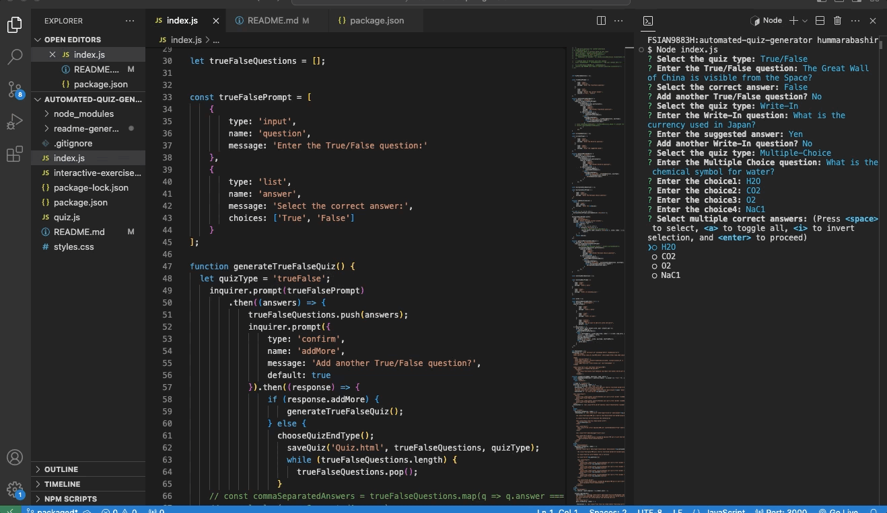
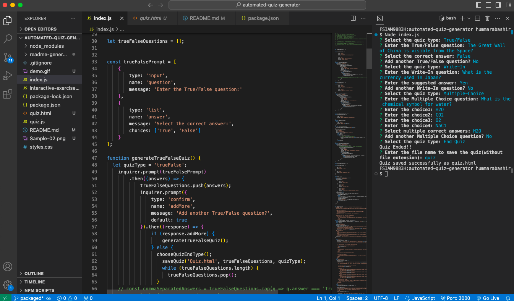
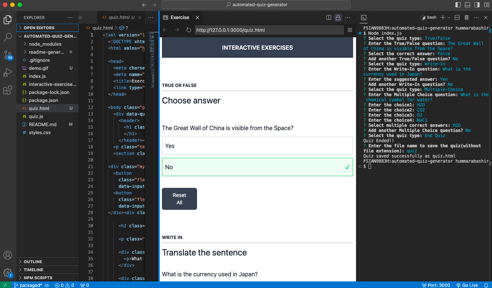

## NPM INQUIRER AUTOMATED QUIZ GENERATOR

```
node index.js
```

<h2>🗣️ About this project</h2>
<p>An automated quiz generator that uses the Inquirer NPM, File System (FS), and Node.js to automatically create multiple interactive quiz files. This tool allows developers to generate quizzes dynamically by prompting users for questions, answer choices, and correct answers through a user-friendly command line interface. By utilizing Inquirer.js, the generator can handle various activity types, including multiple-choice, write-in, matching-pair and true/false formats directly from the command line.
The NPM Inquirer Automated Quiz Generator is a powerful tool designed to enhance learning experiences by enabling educators and trainers to create customized quizzes effortlessly and quickly without the need for extensive programming knowledge. Additionally, the quizzes can be exported in a format to view in the browser.</p>

<h2>👨‍💻 Demo</h2>

<table>
<tr>
<td></td>
<td></td>
</tr>
</table>

<h2>🛠️ Usage</h2>
<p>To use the AUTOMATED QUIZ generator run command: "Node index.js" in the terminal, and answer/follow the on-screen prompts. This command will initiate a series of prompts designed to gather the necessary information for your quiz. Once you have completed the prompts, you will be prompted to provide a custom filename for your quiz. After finalizing your input, the quiz file will be generated and saved in the root folder of your project directory. You can easily access and view the quiz by opening the generated file in your web browser.</p>

<h2>シ Show your support</h2>
<p>Give a ⭐️ if this project helps you or you like it.</p>